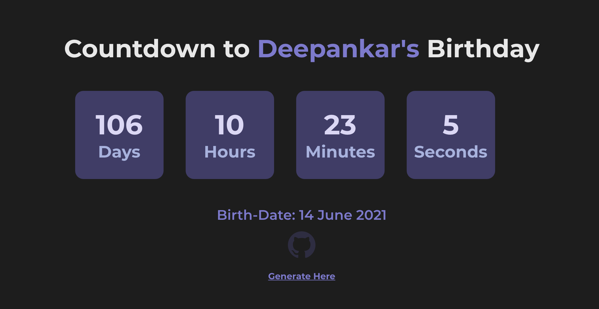
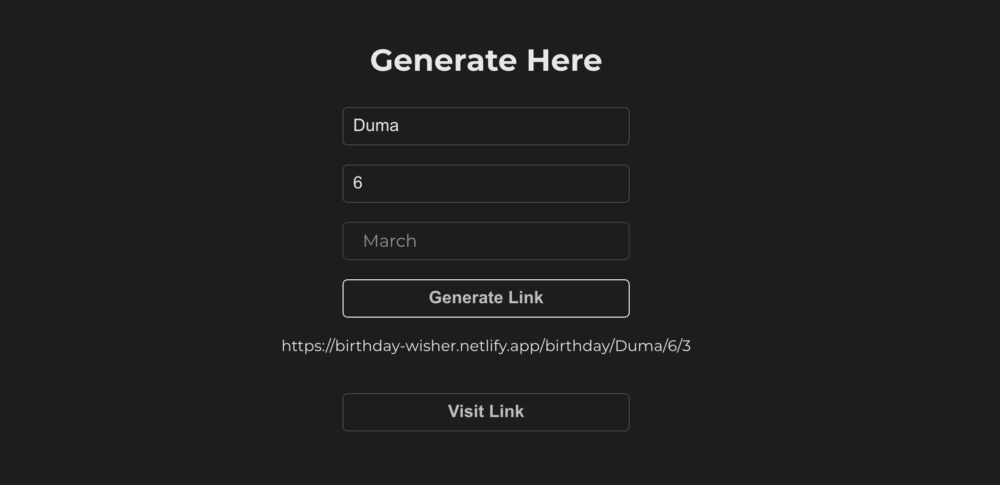

# 🎂 WishClock - Modern Pink Sweet Theme ✨

A beautiful, modern birthday countdown and celebration website with **real-world features** and **3D animations**! Built with React and styled with a gorgeous pink sweet theme.



## 🌟 **Live Demo**

Visit the live website: [https://birthday-wisher.netlify.app/](https://birthday-wisher.netlify.app/)

## 🚀 **New Features (2024 Update)**

### 🎨 **Modern Design**
- **Pink Sweet Theme** - Beautiful gradients and animations
- **3D Card Effects** - Glassmorphism with backdrop blur
- **Floating Particles** - Animated background elements
- **Smooth Animations** - Entrance effects and hover interactions
- **Responsive Design** - Works perfectly on all devices
- **WishClock Logo** - Beautiful animated logo with clock hands

### 💝 **Personalized Message System**
- **Send Birthday Wishes** - Friends can leave personalized messages
- **Message Viewer** - View all birthday messages with navigation
- **Auto-rotation** - Messages automatically cycle every 5 seconds
- **Local Storage** - Messages are saved in the browser

### 🎁 **Real-World Birthday Planning Tools**

#### **Gift Suggestions**
- **Electronics**: Smartphone, Smart Watch, Wireless Earbuds, etc.
- **Fashion**: Designer Bag, Jewelry Set, Watch, Perfume, etc.
- **Home & Living**: Smart Speaker, Coffee Maker, Plant Pot, etc.
- **Experiences**: Spa Day, Concert Tickets, Travel Voucher, etc.
- **Personalized**: Custom T-Shirt, Photo Album, Engraved Jewelry, etc.

#### **Event Planning Ideas**
- **Home Party**: Theme Decoration, Birthday Cake, Music Playlist, etc.
- **Outdoor**: Park Picnic, Beach Party, Garden Celebration, etc.
- **Restaurant**: Fine Dining, Pizza Party, Dessert Cafe, etc.
- **Virtual**: Zoom Party, Online Games, Virtual Cake Cutting, etc.

#### **Social Media Ready**
- **Instagram Templates** - Ready-to-use captions with hashtags
- **WhatsApp Templates** - Perfect for group messages
- **Facebook Templates** - For social media posts
- **Twitter Templates** - Short and sweet tweets
- **One-click copy** for all templates

#### **Birthday Tools**
- **📅 Add to Calendar** - Direct link to Google Calendar
- **📧 Set Reminder** - Email reminder system
- **📱 Share Countdown** - Native sharing with friends
- **🎵 Birthday Playlist** - Direct link to Spotify playlist

### 🎊 **Celebration Effects**
- **Confetti Animation** - Falling confetti pieces
- **Birthday Stickers** - Floating celebration emojis
- **Poppers Effect** - Exploding celebration animations
- **Shimmer Effects** - Beautiful light reflections

## 🛠️ **Getting Started**

### Prerequisites
- Node.js (version 14 or higher)
- npm or yarn

### Installation

1. **Clone the repository**
   ```bash
   git clone https://github.com/your-username/wishclock.git
   cd wishclock
   ```

2. **Install dependencies**
   ```bash
   npm install
   ```

3. **Start the development server**
   ```bash
   npm start
   ```

4. **Open your browser**
   Navigate to `http://localhost:3000`

### For Production Build
```bash
npm run build
```

## 📱 **How to Use**

### **Method 1: Generate Custom Link**
1. Visit [https://birthday-wisher.netlify.app/generate](https://birthday-wisher.netlify.app/generate)
2. Enter the **name**, **day**, and **month** of the birthday person
3. Click "Generate Link"
4. Copy the generated link and share it with friends!

### **Method 2: Direct URL**
Use the format: `https://birthday-wisher.netlify.app/birthday/{name}/{day}/{month}`

**Example:**
- `https://birthday-wisher.netlify.app/birthday/Buddy/25/12` (Buddy's birthday on December 25th)

### **Default Countdown**
If no parameters are provided, it shows a countdown for **Buddy's birthday on December 25th**.

## 🎯 **Features Breakdown**

### **Countdown Page**
- ⏰ **Real-time countdown** with days, hours, minutes, seconds
- 🎨 **Beautiful animations** and 3D effects
- 📱 **Share countdown** with friends
- 💝 **Send birthday wishes** to the person
- 👀 **View all messages** from friends
- 🎁 **Birthday planning tools** (gifts, events, social media)

### **Birthday Celebration Page**
- 🎂 **Happy Birthday message** with the person's name
- 🎊 **Celebration effects** (confetti, stickers, poppers)
- 💌 **Personalized messages** from friends
- 🔄 **Auto-rotating messages** every 5 seconds
- 📝 **Add new messages** directly on the page

### **Message System**
- ✍️ **Send personalized messages** with sender name
- 📖 **View all messages** with navigation
- 🗑️ **Clear all messages** option
- 💾 **Local storage** - messages persist in browser
- ⏰ **Timestamp** for each message

## 🎨 **Design Features**

### **Color Scheme**
- **Primary Pink**: `#ff69b4` (Hot Pink)
- **Secondary Pink**: `#da70d6` (Orchid)
- **Light Pink**: `#ffb6c1` (Light Pink)
- **Dark Pink**: `#c71585` (Medium Violet Red)

### **Animations**
- **Card Entrance**: 3D flip entrance effects
- **Shimmer**: Light reflection effects
- **Floating**: Gentle up-down movements
- **Confetti**: Falling celebration pieces
- **Stickers**: Floating emoji animations
- **Clock Hands**: Animated clock logo

### **Typography**
- **Font**: Poppins (Google Fonts)
- **Weights**: 400, 600, 700
- **Gradients**: Text gradient effects

## 📱 **Responsive Design**

The website is fully responsive and works perfectly on:
- 📱 **Mobile phones** (320px+)
- 📱 **Tablets** (768px+)
- 💻 **Laptops** (1024px+)
- 🖥️ **Desktop** (1200px+)

## 🔧 **Technical Stack**

- **Frontend**: React.js with Hooks
- **Styling**: CSS3 with modern features
- **Animations**: CSS Keyframes and Transforms
- **Storage**: Local Storage API
- **Deployment**: Netlify
- **Icons**: Emoji and SVG icons

## 📁 **Project Structure**

```
src/
├── App.js              # Main application component
├── App.css             # All styles and animations
├── Birthday.jsx        # Main countdown/celebration page
├── Countdown.jsx       # Countdown timer component
├── Wish.jsx           # Birthday celebration component
├── Generate.jsx       # Link generation page
├── Features.jsx       # Real-world birthday tools
├── AddMessage.jsx     # Message sending component
├── MessageViewer.jsx  # Message viewing component
├── WishClockLogo.jsx  # Beautiful animated logo
└── RouterBirthday.jsx # URL parameter handler
```

## 🌟 **Real-World Use Cases**

### **Personal Use**
- 🎂 **Personal birthday countdowns**
- 💝 **Family birthday celebrations**
- 👥 **Friend birthday planning**

### **Business Use**
- 🏪 **Restaurant birthday promotions**
- 🎁 **Gift shop integrations**
- 🎪 **Event planning services**
- 💼 **Corporate birthday celebrations**

### **Social Media**
- 📱 **Instagram birthday posts**
- 💬 **WhatsApp group celebrations**
- 📘 **Facebook birthday events**
- 🐦 **Twitter birthday announcements**

## 🎉 **Screenshots**

### Countdown Page


### Birthday Celebration


### Generate Link


## 🤝 **Contributing**

1. Fork the repository
2. Create your feature branch (`git checkout -b feature/AmazingFeature`)
3. Commit your changes (`git commit -m 'Add some AmazingFeature'`)
4. Push to the branch (`git push origin feature/AmazingFeature`)
5. Open a Pull Request

## 📄 **License**

This project is licensed under the MIT License - see the [LICENSE](LICENSE) file for details.

## 🙏 **Acknowledgments**

- **React.js** - For the amazing framework
- **CSS3** - For beautiful animations and effects
- **Google Fonts** - For the Poppins font
- **Emoji** - For the beautiful icons

## 📞 **Contact**

- **GitHub**: [@Deep-Codes](https://github.com/Deep-Codes)
- **Live Demo**: [WishClock](https://birthday-wisher.netlify.app/)

---

**Made with ❤️ and lots of 🎂 by Deep-Codes**

*Updated with modern features and pink sweet theme in 2024! 🌸✨*
